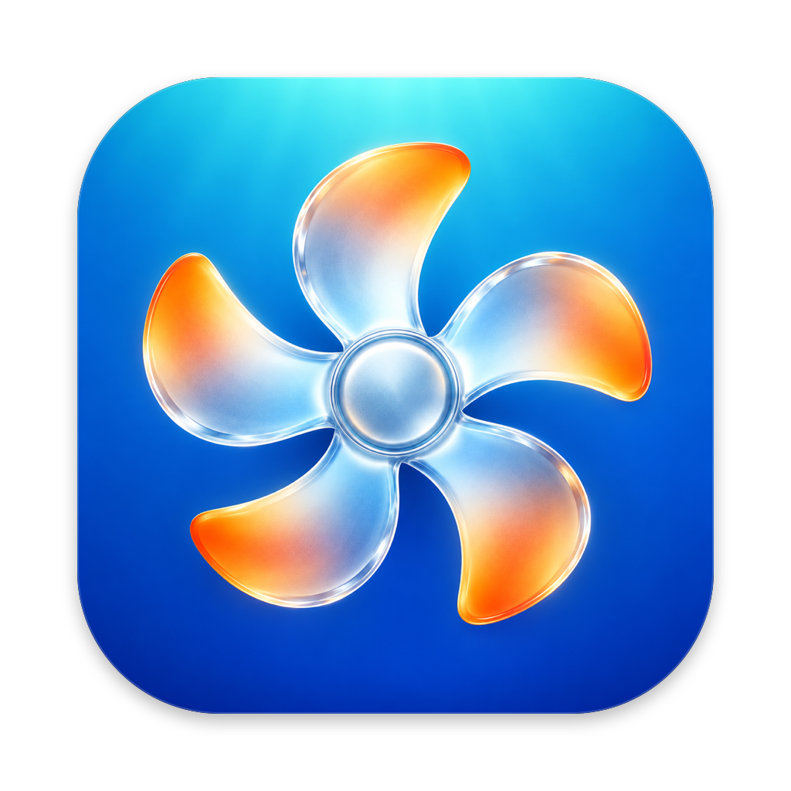
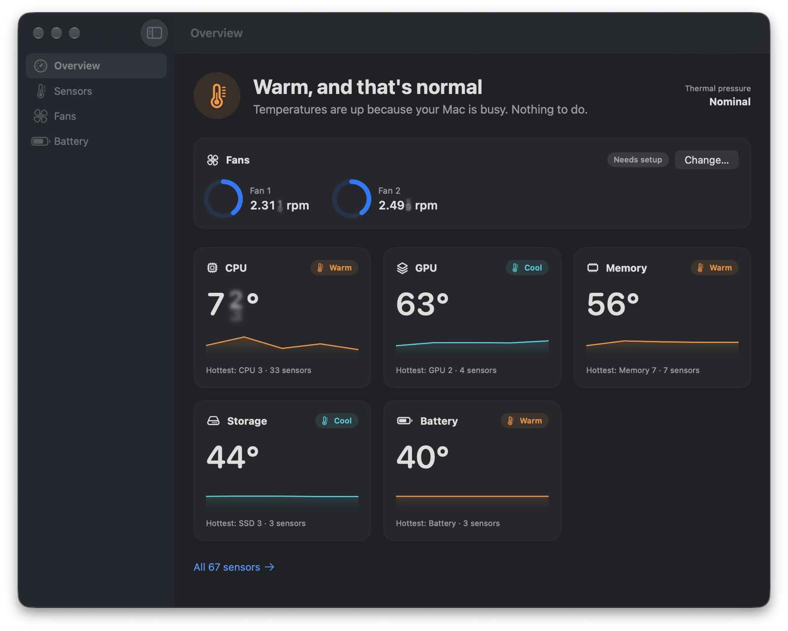
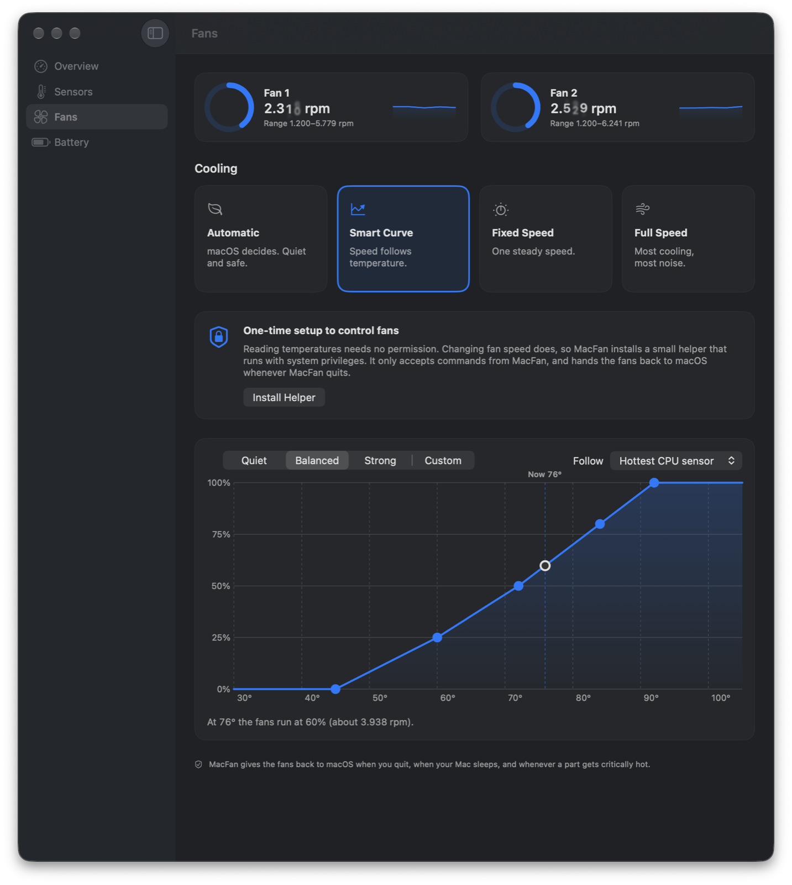
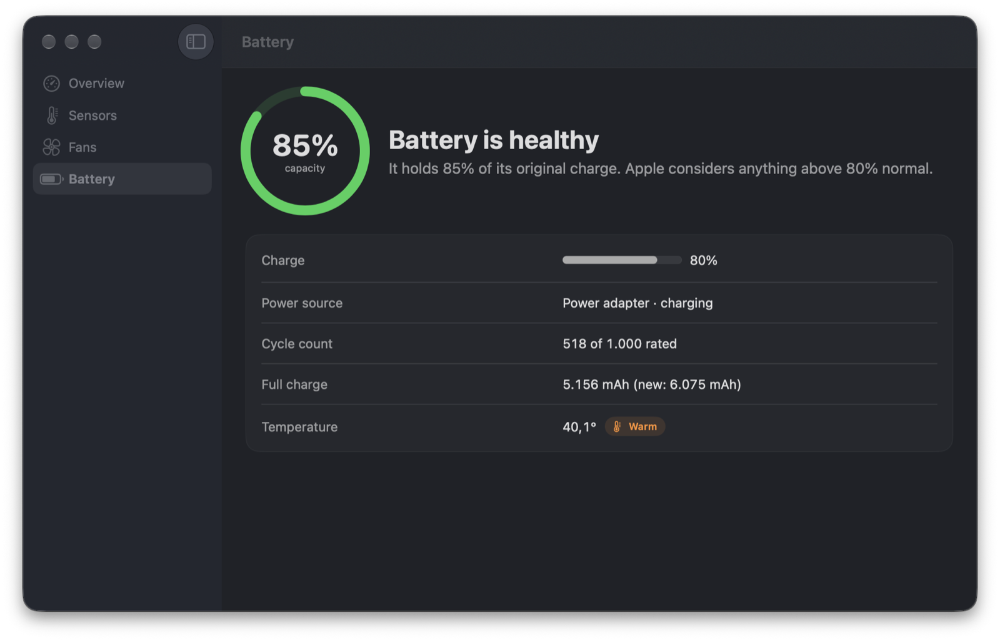

<p align="center">
  
</p>

<h1 align="center">MacFan</h1>

<p align="center">
  <a href="https://github.com/alvinmr/macfan/releases/latest"></a>
  
  
  <a href="LICENSE"></a>
</p>

<p align="center">
  <a href="https://github.com/alvinmr/macfan/releases"><b>Download MacFan</b></a>
</p>

A free, open-source temperature monitor and fan controller for the Mac.

<p align="center">
  
</p>

MacFan answers one question first — *is my Mac OK?* — in plain language, then gets
out of the way. When you want more, every sensor, fan and battery detail is one
click deeper.

## Features

- **Plain-language status.** "Running cool", "Warm, and that's normal", "Running hot",
  with what to do about it. Combines sensor readings with macOS thermal pressure, so it
  also tells you when your Mac is slowing itself down to cool off.
- **Every sensor, grouped.** CPU, GPU, memory, SSD, battery, power, wireless and
  enclosure sensors on Apple Silicon and Intel, each with a 10-minute sparkline.
  Filterable, and with sensible per-part thresholds (a 90 °C CPU is fine; a 50 °C battery is not).
- **Four cooling modes.**
  - *Automatic* — macOS decides (the default).
  - *Smart Curve* — fan speed follows a temperature. Pick Quiet, Balanced or Strong,
    or drag the points to draw your own.
  - *Fixed Speed* — one steady speed.
  - *Full Speed* — everything at maximum.
- **Safety first.** Fans go back to macOS when you quit, when the Mac sleeps, if
  MacFan crashes or stops responding, and whenever a part becomes critically hot.
- **Menu bar.** Temperature, fan speed, or both. Any sensor can be pinned there.
- **Battery health.** Capacity vs. new, cycle count, temperature, and a clear verdict.
- **Alerts** that stay rare enough to mean something: only after 30 s above your
  threshold, at most every 15 minutes.
- **CSV logging**, one file per day.
- **Automatic updates** with [Sparkle](https://sparkle-project.org), verified by signature.
- **`macfan` CLI** for scripts and bug reports.

<p align="center">
  
  
</p>

## Download

Get `MacFan-v<version>-macOS.dmg` from
[Releases](https://github.com/alvinmr/macfan/releases). One download runs
on **Apple Silicon and Intel**, on **macOS 14 Sonoma or later**.

1. Open the DMG and drag **MacFan** to **Applications**.
2. Open MacFan from Applications.

> **0.1.0 is a pre-release.** Monitoring is solid; fan control has only been tested on
> the developer's Mac so far. Please [report](https://github.com/alvinmr/macfan/issues)
> how it behaves on yours.

MacFan is not yet notarized by Apple, so the first time you open it macOS will block it.
If you trust the download, go to **System Settings → Privacy & Security** and click
**Open Anyway**. You only need to do this once. Each release lists the DMG's SHA-256
checksum so you can verify the download:

```sh
shasum -a 256 ~/Downloads/MacFan-v*-macOS.dmg
```

Or install with [Homebrew](https://brew.sh):

```sh
brew install --cask alvinmr/tap/macfan
```

### Updates

MacFan checks for updates once a day and installs them with Sparkle, which verifies each
update's signature before installing it. Use **MacFan → Check for Updates…** to check now,
or turn automatic checks off in **Settings → General**.

## Build from source

Requires Xcode 26 / Swift 6.2 or later.

```sh
make app     # builds and signs build/MacFan.app (ad-hoc)
make dmg     # universal app + DMG + checksum, exactly as releases are built
make run     # builds, then opens it
make test    # unit tests
```

Or from source without bundling: `swift run MacFan` (alerts and helper installation
need the bundled app).

### Command line

```sh
swift run macfan sensors        # recognised sensors
swift run macfan sensors --all  # including unidentified ones
swift run macfan fans
swift run macfan battery
swift run macfan keys           # raw SMC temperature keys, for contributors
```

## Fan control and the helper

Reading temperatures needs no permission. *Changing* fan speed requires root, so
MacFan installs a small privileged helper the first time you pick a mode other than
Automatic (**Fans → Install Helper**). macOS will ask you to allow it in
**System Settings → General → Login Items → Allow in the Background**.

The helper's entire interface is three calls: *version*, *set fan target*, *give fans
back to macOS*. It:

- only accepts connections from an app signed as `io.github.alvinmr.MacFan` (and, for
  Developer ID builds, signed by the same team as the helper);
- returns all fans to macOS when the app disconnects, when it receives no command for
  20 seconds, and when it is stopped.

Remove it any time from **Settings → Helper → Uninstall Helper**.

### Troubleshooting

**"The helper is registered but isn't responding."** Some macOS versions refuse to
launch daemons from ad-hoc signed apps. Either sign with a Developer ID:

```sh
SIGN_IDENTITY="Developer ID Application: Your Name (TEAMID)" make app
```

…or, for local development only, install the helper the classic way:

```sh
sudo scripts/install-helper-dev.sh install
sudo scripts/install-helper-dev.sh uninstall   # to remove
```

**A sensor has a generic name like "Sensor TC2X".** MacFan doesn't know that key yet.
See [Adding sensors](docs/ADDING_SENSORS.md) — it's usually a one-line change.

## Security

- No network access, analytics or tracking.
- The only privileged code is `Sources/MacFanHelper` (under 200 lines) plus the SMC writer
  in `Sources/SMCKit/SMCFanControl.swift`. Please review them.
- Ad-hoc builds can only pin the client's bundle identifier. Distributed builds should
  be signed with a Developer ID and notarized so the helper also pins the team.

## Project layout

| Module | What it does |
| --- | --- |
| `CPrivateIOKit` | C declarations: SMC parameter block, private HID temperature API |
| `SMCKit` | Talks to the SMC: keys, value encoding, fan control |
| `MacFanCore` | Domain logic: sensors, catalog, curves, safety, history, logging. No UI. |
| `MacFanXPC` | The app ↔ helper contract |
| `MacFanHelper` | The root daemon |
| `MacFanCLI` | The `macfan` command |
| `MacFan` | The SwiftUI app |

More in [docs/ARCHITECTURE.md](docs/ARCHITECTURE.md); how releases are cut is in
[docs/RELEASING.md](docs/RELEASING.md). Contributions are welcome —
see [CONTRIBUTING.md](CONTRIBUTING.md).

## Disclaimer

Changing fan speeds is at your own risk. MacFan never lets fans run below the
firmware's minimum and hands control back to macOS whenever something looks wrong,
but no software can promise your hardware is safe.

MacFan is not affiliated with Apple or with Tunabelly Software (TG Pro).

## License

[MIT](LICENSE)
